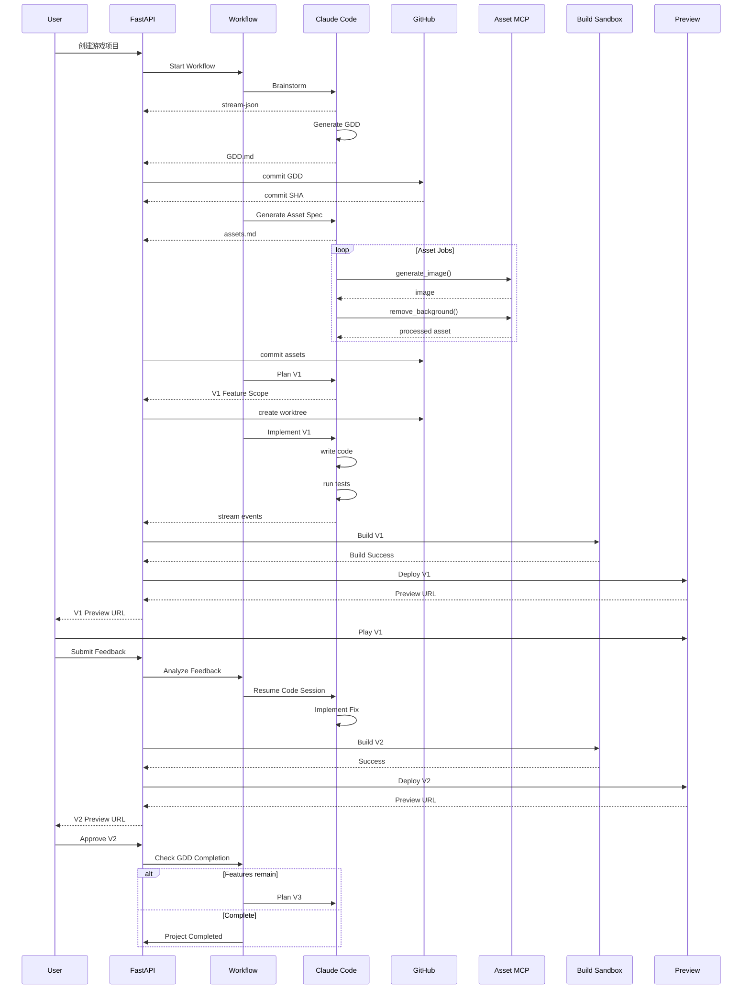
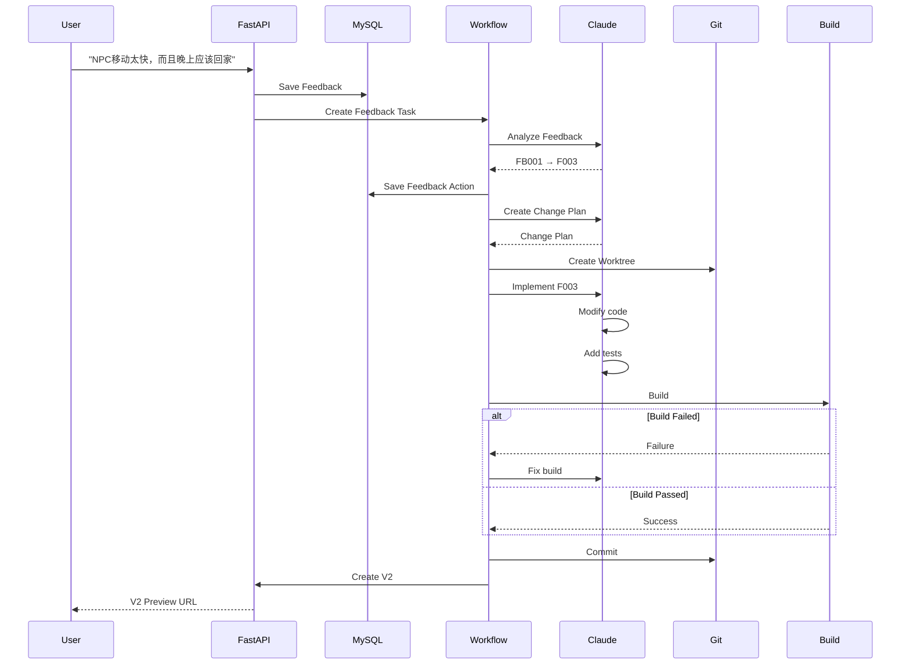

# AI\_Cowork\_Game Backend v0.1 技术实现方案

**版本：v0.1**

**定位：后端 MVP / 第一版可实现架构**

---

# 1. 目标

AI\_Cowork\_Game 是一个基于 Claude Code CLI 的 AI 游戏协作研发后端。

系统核心目标：

> 用户提供游戏创意 → AI 协作完成 GDD → 生成美术资产 → 生成可试玩游戏 V1 → 用户试玩 → 用户反馈 → AI 修改 → V2/V3/... → 用户确认 → 游戏完成。

核心闭环：

```text
                    User
                     │
                     ▼
              ┌──────────────┐
              │ Brainstorming │
              └──────┬───────┘
                     │
                     ▼
                 GDD Agent
                     │
                     ▼
                  GDD.md
                     │
          ┌──────────┴──────────┐
          ▼                     ▼
     Art Design             Feature Plan
          │                     │
          ▼                     ▼
     Asset Pipeline         Game Code Agent
          │                     │
          └──────────┬──────────┘
                     ▼
                  Build
                     │
                     ▼
                Play Preview
                     │
                     ▼
                User Playtest
                     │
                     ▼
                  Feedback
                     │
                     ▼
             Feedback Analyzer
                     │
                     ▼
                Code Agent
                     │
                     ▼
                    Vn
                     │
                ┌────┴────┐
                │         │
             通过       不通过
                │         │
                ▼         └──────→ 下一轮迭代
          User Accepted
                │
                ▼
             COMPLETE
```

---

# 2. 总体技术架构

```text
                         ┌─────────────────────┐
                         │        User         │
                         └──────────┬──────────┘
                                    │
                              REST / WebSocket
                                    │
                                    ▼
┌────────────────────────────────────────────────────────────┐
│                    FastAPI Backend                         │
│                                                            │
│  ┌────────────────┐     ┌───────────────────────────────┐ │
│  │ Project Service│     │ Conversation Service          │ │
│  └───────┬────────┘     └──────────────┬────────────────┘ │
│          │                             │                  │
│          └──────────────┬──────────────┘                  │
│                         ▼                                 │
│              ┌──────────────────────┐                     │
│              │ Workflow Orchestrator│                     │
│              └──────────┬───────────┘                     │
│                         │                                 │
│        ┌────────────────┼───────────────────┐             │
│        ▼                ▼                   ▼             │
│ Claude Runtime     Asset Service       Build Service      │
│        │                │                   │             │
│        ▼                ▼                   ▼             │
│ Claude Code CLI     MCP Asset Server    Docker Sandbox   │
│        │                │                   │             │
│        ▼                ▼                   ▼             │
│     Skills          Image APIs          Game Build       │
│     Agents          Remove BG           Game Test        │
│     Superpowers                                               │
│                                                            │
└───────────────────────┬────────────────────────────────────┘
                        │
              ┌─────────┴──────────┐
              ▼                    ▼
           MySQL                  Redis
        持久化状态              Queue/Event/Lock
              │
              ▼
           GitHub
              │
              ▼
        Git Repository
              │
              ▼
         Git Worktree
              │
              ▼
         Game Workspace
```

---

# 3. 技术栈

| 层                 | 技术                           |
| ----------------- | ---------------------------- |
| API               | FastAPI                      |
| Language          | Python 3.12+                 |
| ORM               | SQLAlchemy 2.x               |
| Validation        | Pydantic v2                  |
| Database          | MySQL 8.0+                   |
| Queue             | Redis                        |
| Worker            | Arq                          |
| Agent Runtime     | Claude Code CLI              |
| Agent Protocol    | `stream-json`                |
| Agent Skills      | Claude Code Skills           |
| Engineering Skill | Superpowers                  |
| External Tool     | MCP                          |
| Git               | Git CLI                      |
| GitHub            | GitHub App                   |
| Isolation         | Docker                       |
| Game Runtime      | Web / TypeScript / Canvas    |
| Build             | npm / Vite                   |
| Preview           | Object Storage + CDN / Nginx |
| Logs              | JSON structured logging      |
| Metrics           | Prometheus / OpenTelemetry   |

第一版不引入 Kafka、Kubernetes、Temporal。

先用：

```text
FastAPI
+
MySQL
+
Redis
+
Arq
+
Docker
+
Claude Code CLI
```

把核心闭环跑通。

---

# 4. 核心架构原则

## 4.1 Claude Code 是 Agent Runtime，不是 Workflow Engine

错误：

```text
Claude
 └── 自己决定：
     GDD
     Art
     Code
     Build
     Deploy
     Feedback
```

正确：

```text
Backend Workflow
      │
      ├── invoke GDD Agent
      ├── invoke Art Agent
      ├── invoke Code Agent
      ├── invoke Test Agent
      └── invoke Review Agent
```

Backend 负责：

- 状态机
- Job
- Retry
- Timeout
- User Gate
- Version
- Git
- Build
- Preview
- Feedback

Claude 负责：

- 推理
- 设计
- 代码
- 工具调用
- Skill 执行
- 测试分析

---

# 5. FastAPI 项目目录

```text
ai-cowork-game/
│
├── backend/
│   │
│   ├── app/
│   │   ├── main.py
│   │   │
│   │   ├── config/
│   │   │   ├── settings.py
│   │   │   └── logging.py
│   │   │
│   │   ├── api/
│   │   │   ├── projects.py
│   │   │   ├── conversations.py
│   │   │   ├── gdd.py
│   │   │   ├── assets.py
│   │   │   ├── versions.py
│   │   │   ├── feedback.py
│   │   │   ├── previews.py
│   │   │   └── events.py
│   │   │
│   │   ├── schemas/
│   │   │   ├── project.py
│   │   │   ├── agent.py
│   │   │   ├── gdd.py
│   │   │   ├── asset.py
│   │   │   ├── version.py
│   │   │   └── feedback.py
│   │   │
│   │   ├── models/
│   │   │   ├── project.py
│   │   │   ├── agent_session.py
│   │   │   ├── workflow.py
│   │   │   ├── feature.py
│   │   │   ├── asset.py
│   │   │   ├── version.py
│   │   │   ├── build.py
│   │   │   ├── preview.py
│   │   │   ├── feedback.py
│   │   │   └── event.py
│   │   │
│   │   ├── services/
│   │   │   ├── project_service.py
│   │   │   ├── conversation_service.py
│   │   │   ├── gdd_service.py
│   │   │   ├── feature_service.py
│   │   │   ├── asset_service.py
│   │   │   ├── version_service.py
│   │   │   ├── feedback_service.py
│   │   │   └── preview_service.py
│   │   │
│   │   ├── agent/
│   │   │   ├── runtime.py
│   │   │   ├── cli.py
│   │   │   ├── session.py
│   │   │   ├── parser.py
│   │   │   ├── events.py
│   │   │   ├── prompts.py
│   │   │   └── policies.py
│   │   │
│   │   ├── workflow/
│   │   │   ├── engine.py
│   │   │   ├── states.py
│   │   │   ├── transitions.py
│   │   │   ├── handlers.py
│   │   │   └── definitions.py
│   │   │
│   │   ├── git/
│   │   │   ├── git_client.py
│   │   │   ├── github_client.py
│   │   │   ├── repository.py
│   │   │   └── worktree.py
│   │   │
│   │   ├── sandbox/
│   │   │   ├── docker.py
│   │   │   ├── runner.py
│   │   │   ├── limits.py
│   │   │   └── policies.py
│   │   │
│   │   ├── queue/
│   │   │   ├── worker.py
│   │   │   ├── tasks.py
│   │   │   └── jobs.py
│   │   │
│   │   └── security/
│   │       ├── secrets.py
│   │       ├── path_policy.py
│   │       └── command_policy.py
│   │
│   ├── workers/
│   │   └── main.py
│   │
│   ├── migrations/
│   │
│   ├── tests/
│   │
│   ├── Dockerfile
│   └── pyproject.toml
│
├── agent/
│   ├── plugins/
│   │   ├── superpowers/
│   │   └── game-skills/
│   │
│   └── configs/
│       ├── code-agent-settings.json
│       ├── design-agent-settings.json
│       └── asset-agent-settings.json
│
├── game-template/
│
├── docker/
│   ├── agent-runtime/
│   ├── build-runtime/
│   └── preview-runtime/
│
├── docs/
│   ├── architecture.md
│   ├── workflow.md
│   └── protocols/
│
└── docker-compose.yml
```

---

# 6. MySQL 数据库

数据库：

```text
ai_cowork_game
```

字符集：

```text
utf8mb4
```

推荐：

```text
ENGINE=InnoDB
```

核心表：

```text
users

projects

project_repositories

agent_sessions

workflow_runs

workflow_tasks

gdd_documents

features

assets

asset_jobs

game_versions

builds

previews

feedbacks

feedback_actions

git_commits

events
```

---

# 7. projects

```sql
CREATE TABLE projects (
    id BIGINT UNSIGNED PRIMARY KEY AUTO_INCREMENT,

    project_key VARCHAR(64) NOT NULL UNIQUE,
    name VARCHAR(255) NOT NULL,
    description TEXT,

    status VARCHAR(32) NOT NULL,

    current_version_id BIGINT UNSIGNED NULL,
    current_workflow_run_id BIGINT UNSIGNED NULL,

    workspace_root VARCHAR(1024) NOT NULL,

    created_at DATETIME(6) NOT NULL,
    updated_at DATETIME(6) NOT NULL,

    INDEX idx_projects_status(status)
) ENGINE=InnoDB DEFAULT CHARSET=utf8mb4;
```

状态：

```text
CREATED
BRAINSTORMING
GDD
ART
CODING
TESTING
PLAYTESTING
ITERATING
COMPLETED
FAILED
```

---

# 8. project\_repositories

```sql
CREATE TABLE project_repositories (
    id BIGINT UNSIGNED PRIMARY KEY AUTO_INCREMENT,

    project_id BIGINT UNSIGNED NOT NULL,

    provider VARCHAR(32) NOT NULL,
    owner VARCHAR(255) NOT NULL,
    repository VARCHAR(255) NOT NULL,

    clone_url VARCHAR(1024) NOT NULL,
    default_branch VARCHAR(128) NOT NULL DEFAULT 'main',

    github_installation_id BIGINT UNSIGNED NULL,

    created_at DATETIME(6) NOT NULL,
    updated_at DATETIME(6) NOT NULL,

    UNIQUE KEY uk_project_repo(project_id),

    CONSTRAINT fk_repo_project
        FOREIGN KEY(project_id)
        REFERENCES projects(id)
) ENGINE=InnoDB DEFAULT CHARSET=utf8mb4;
```

---

# 9. agent\_sessions

```sql
CREATE TABLE agent_sessions (
    id BIGINT UNSIGNED PRIMARY KEY AUTO_INCREMENT,

    project_id BIGINT UNSIGNED NOT NULL,

    claude_session_id VARCHAR(128) NOT NULL,

    agent_type VARCHAR(64) NOT NULL,

    status VARCHAR(32) NOT NULL,

    working_directory VARCHAR(1024) NOT NULL,

    last_message_at DATETIME(6) NULL,

    created_at DATETIME(6) NOT NULL,
    updated_at DATETIME(6) NOT NULL,

    UNIQUE KEY uk_claude_session(claude_session_id),

    INDEX idx_agent_project(project_id),
    INDEX idx_agent_status(status),

    CONSTRAINT fk_agent_project
        FOREIGN KEY(project_id)
        REFERENCES projects(id)
) ENGINE=InnoDB DEFAULT CHARSET=utf8mb4;
```

`agent_type`：

```text
BRAINSTORM
GDD
ART
CODE
TEST
REVIEW
FEEDBACK
```

---

# 10. workflow\_runs

```sql
CREATE TABLE workflow_runs (
    id BIGINT UNSIGNED PRIMARY KEY AUTO_INCREMENT,

    project_id BIGINT UNSIGNED NOT NULL,

    workflow_type VARCHAR(64) NOT NULL,

    status VARCHAR(32) NOT NULL,

    current_state VARCHAR(64) NOT NULL,

    input_json JSON NULL,
    output_json JSON NULL,

    started_at DATETIME(6) NULL,
    finished_at DATETIME(6) NULL,

    created_at DATETIME(6) NOT NULL,
    updated_at DATETIME(6) NOT NULL,

    INDEX idx_workflow_project(project_id),
    INDEX idx_workflow_status(status),

    CONSTRAINT fk_workflow_project
        FOREIGN KEY(project_id)
        REFERENCES projects(id)
) ENGINE=InnoDB DEFAULT CHARSET=utf8mb4;
```

---

# 11. workflow\_tasks

```sql
CREATE TABLE workflow_tasks (
    id BIGINT UNSIGNED PRIMARY KEY AUTO_INCREMENT,

    workflow_run_id BIGINT UNSIGNED NOT NULL,

    task_key VARCHAR(128) NOT NULL,
    task_type VARCHAR(64) NOT NULL,

    status VARCHAR(32) NOT NULL,

    attempt INT NOT NULL DEFAULT 0,
    max_attempts INT NOT NULL DEFAULT 3,

    input_json JSON NULL,
    output_json JSON NULL,
    error_json JSON NULL,

    started_at DATETIME(6) NULL,
    finished_at DATETIME(6) NULL,

    created_at DATETIME(6) NOT NULL,
    updated_at DATETIME(6) NOT NULL,

    INDEX idx_task_run(workflow_run_id),
    INDEX idx_task_status(status),

    UNIQUE KEY uk_workflow_task(workflow_run_id, task_key),

    CONSTRAINT fk_task_workflow
        FOREIGN KEY(workflow_run_id)
        REFERENCES workflow_runs(id)
) ENGINE=InnoDB DEFAULT CHARSET=utf8mb4;
```

---

# 12. gdd\_documents

```sql
CREATE TABLE gdd_documents (
    id BIGINT UNSIGNED PRIMARY KEY AUTO_INCREMENT,

    project_id BIGINT UNSIGNED NOT NULL,

    version INT NOT NULL,

    file_path VARCHAR(1024) NOT NULL,

    git_commit VARCHAR(64) NULL,

    content_hash VARCHAR(128) NOT NULL,

    status VARCHAR(32) NOT NULL,

    created_at DATETIME(6) NOT NULL,

    UNIQUE KEY uk_gdd_version(project_id, version),

    CONSTRAINT fk_gdd_project
        FOREIGN KEY(project_id)
        REFERENCES projects(id)
) ENGINE=InnoDB DEFAULT CHARSET=utf8mb4;
```

注意：

**GDD 正文不建议全部存 MySQL。**

MySQL 保存：

```text
metadata
version
hash
git commit
status
```

真实内容：

```text
GitHub Repository
```

---

# 13. features

这是 V1 → Vn 最核心的表。

```sql
CREATE TABLE features (
    id BIGINT UNSIGNED PRIMARY KEY AUTO_INCREMENT,

    project_id BIGINT UNSIGNED NOT NULL,

    feature_key VARCHAR(64) NOT NULL,

    name VARCHAR(255) NOT NULL,
    description TEXT,

    priority VARCHAR(16) NOT NULL,

    status VARCHAR(32) NOT NULL,

    acceptance_criteria JSON NOT NULL,

    source_gdd_version INT NOT NULL,

    completion_percent INT NOT NULL DEFAULT 0,

    created_at DATETIME(6) NOT NULL,
    updated_at DATETIME(6) NOT NULL,

    UNIQUE KEY uk_feature(project_id, feature_key),

    INDEX idx_feature_status(project_id, status),

    CONSTRAINT fk_feature_project
        FOREIGN KEY(project_id)
        REFERENCES projects(id)
) ENGINE=InnoDB DEFAULT CHARSET=utf8mb4;
```

例如：

```text
F001 Player Movement
F002 Camera
F003 NPC
F004 NPC Schedule
F005 Farming
```

---

# 14. assets

```sql
CREATE TABLE assets (
    id BIGINT UNSIGNED PRIMARY KEY AUTO_INCREMENT,

    project_id BIGINT UNSIGNED NOT NULL,

    asset_key VARCHAR(64) NOT NULL,

    asset_type VARCHAR(64) NOT NULL,

    name VARCHAR(255) NOT NULL,

    specification JSON NOT NULL,

    status VARCHAR(32) NOT NULL,

    source_url VARCHAR(2048) NULL,
    processed_url VARCHAR(2048) NULL,

    content_hash VARCHAR(128) NULL,

    created_at DATETIME(6) NOT NULL,
    updated_at DATETIME(6) NOT NULL,

    UNIQUE KEY uk_asset(project_id, asset_key),

    INDEX idx_asset_status(project_id, status),

    CONSTRAINT fk_asset_project
        FOREIGN KEY(project_id)
        REFERENCES projects(id)
) ENGINE=InnoDB DEFAULT CHARSET=utf8mb4;
```

---

# 15. asset\_jobs

```sql
CREATE TABLE asset_jobs (
    id BIGINT UNSIGNED PRIMARY KEY AUTO_INCREMENT,

    asset_id BIGINT UNSIGNED NOT NULL,

    provider VARCHAR(64) NOT NULL,

    operation VARCHAR(64) NOT NULL,

    status VARCHAR(32) NOT NULL,

    request_json JSON NULL,
    response_json JSON NULL,

    attempt INT NOT NULL DEFAULT 0,

    error_message TEXT NULL,

    started_at DATETIME(6) NULL,
    finished_at DATETIME(6) NULL,

    created_at DATETIME(6) NOT NULL,

    INDEX idx_asset_job(asset_id),
    INDEX idx_asset_job_status(status),

    CONSTRAINT fk_asset_job_asset
        FOREIGN KEY(asset_id)
        REFERENCES assets(id)
) ENGINE=InnoDB DEFAULT CHARSET=utf8mb4;
```

---

# 16. game\_versions

```sql
CREATE TABLE game_versions (
    id BIGINT UNSIGNED PRIMARY KEY AUTO_INCREMENT,

    project_id BIGINT UNSIGNED NOT NULL,

    version_number INT NOT NULL,

    version_name VARCHAR(64) NOT NULL,

    git_commit VARCHAR(64) NOT NULL,
    git_tag VARCHAR(128) NULL,

    scope JSON NOT NULL,

    status VARCHAR(32) NOT NULL,

    ai_test_status VARCHAR(32) NULL,
    user_test_status VARCHAR(32) NULL,

    completion_percent INT NOT NULL DEFAULT 0,

    release_notes TEXT NULL,

    created_at DATETIME(6) NOT NULL,
    updated_at DATETIME(6) NOT NULL,

    UNIQUE KEY uk_project_version(project_id, version_number),

    INDEX idx_version_status(project_id, status),

    CONSTRAINT fk_version_project
        FOREIGN KEY(project_id)
        REFERENCES projects(id)
) ENGINE=InnoDB DEFAULT CHARSET=utf8mb4;
```

---

# 17. builds

```sql
CREATE TABLE builds (
    id BIGINT UNSIGNED PRIMARY KEY AUTO_INCREMENT,

    project_id BIGINT UNSIGNED NOT NULL,
    version_id BIGINT UNSIGNED NOT NULL,

    git_commit VARCHAR(64) NOT NULL,

    status VARCHAR(32) NOT NULL,

    image_tag VARCHAR(255) NULL,

    artifact_url VARCHAR(2048) NULL,

    build_log TEXT NULL,

    started_at DATETIME(6) NULL,
    finished_at DATETIME(6) NULL,

    created_at DATETIME(6) NOT NULL,

    INDEX idx_build_project(project_id),
    INDEX idx_build_version(version_id),

    CONSTRAINT fk_build_project
        FOREIGN KEY(project_id)
        REFERENCES projects(id),

    CONSTRAINT fk_build_version
        FOREIGN KEY(version_id)
        REFERENCES game_versions(id)
) ENGINE=InnoDB DEFAULT CHARSET=utf8mb4;
```

---

# 18. previews

```sql
CREATE TABLE previews (
    id BIGINT UNSIGNED PRIMARY KEY AUTO_INCREMENT,

    project_id BIGINT UNSIGNED NOT NULL,
    version_id BIGINT UNSIGNED NOT NULL,
    build_id BIGINT UNSIGNED NOT NULL,

    preview_url VARCHAR(2048) NOT NULL,

    status VARCHAR(32) NOT NULL,

    expires_at DATETIME(6) NULL,

    created_at DATETIME(6) NOT NULL,

    INDEX idx_preview_version(version_id),

    CONSTRAINT fk_preview_project
        FOREIGN KEY(project_id)
        REFERENCES projects(id),

    CONSTRAINT fk_preview_version
        FOREIGN KEY(version_id)
        REFERENCES game_versions(id)
) ENGINE=InnoDB DEFAULT CHARSET=utf8mb4;
```

---

# 19. feedbacks

```sql
CREATE TABLE feedbacks (
    id BIGINT UNSIGNED PRIMARY KEY AUTO_INCREMENT,

    project_id BIGINT UNSIGNED NOT NULL,
    version_id BIGINT UNSIGNED NOT NULL,

    content TEXT NOT NULL,

    category VARCHAR(32) NULL,
    severity VARCHAR(16) NULL,

    analysis JSON NULL,

    status VARCHAR(32) NOT NULL,

    created_at DATETIME(6) NOT NULL,
    updated_at DATETIME(6) NOT NULL,

    INDEX idx_feedback_version(version_id),
    INDEX idx_feedback_status(status),

    CONSTRAINT fk_feedback_project
        FOREIGN KEY(project_id)
        REFERENCES projects(id),

    CONSTRAINT fk_feedback_version
        FOREIGN KEY(version_id)
        REFERENCES game_versions(id)
) ENGINE=InnoDB DEFAULT CHARSET=utf8mb4;
```

---

# 20. feedback\_actions

```sql
CREATE TABLE feedback_actions (
    id BIGINT UNSIGNED PRIMARY KEY AUTO_INCREMENT,

    feedback_id BIGINT UNSIGNED NOT NULL,

    feature_id BIGINT UNSIGNED NULL,

    action_type VARCHAR(32) NOT NULL,

    description TEXT NOT NULL,

    status VARCHAR(32) NOT NULL,

    created_at DATETIME(6) NOT NULL,
    updated_at DATETIME(6) NOT NULL,

    INDEX idx_feedback_action(feedback_id),

    CONSTRAINT fk_action_feedback
        FOREIGN KEY(feedback_id)
        REFERENCES feedbacks(id),

    CONSTRAINT fk_action_feature
        FOREIGN KEY(feature_id)
        REFERENCES features(id)
) ENGINE=InnoDB DEFAULT CHARSET=utf8mb4;
```

---

# 21. events

系统所有重要状态变化写入 Event。

```sql
CREATE TABLE events (
    id BIGINT UNSIGNED PRIMARY KEY AUTO_INCREMENT,

    project_id BIGINT UNSIGNED NOT NULL,

    event_id CHAR(36) NOT NULL,
    event_type VARCHAR(64) NOT NULL,

    aggregate_type VARCHAR(64) NOT NULL,
    aggregate_id BIGINT UNSIGNED NOT NULL,

    payload JSON NOT NULL,

    created_at DATETIME(6) NOT NULL,

    UNIQUE KEY uk_event(event_id),

    INDEX idx_event_project(project_id),
    INDEX idx_event_aggregate(
        aggregate_type,
        aggregate_id
    ),
    INDEX idx_event_created(created_at),

    CONSTRAINT fk_event_project
        FOREIGN KEY(project_id)
        REFERENCES projects(id)
) ENGINE=InnoDB DEFAULT CHARSET=utf8mb4;
```

---

# 22. MySQL 与 Redis 的职责

不要把所有东西都放 MySQL。

```text
MySQL
│
├── Project
├── Workflow
├── Feature
├── Asset
├── Version
├── Build
├── Preview
├── Feedback
└── Event History
```

Redis：

```text
Redis
│
├── Job Queue
├── Project Lock
├── Agent Lock
├── Event Stream
├── Pub/Sub
└── Temporary Session State
```

例如：

```text
lock:project:10001

lock:workspace:10001

stream:project:10001

queue:agent

queue:asset

queue:build
```

---

# 23. Workflow 状态机

整个 Project：

```text
CREATED
   │
   ▼
BRAINSTORMING
   │
   ▼
GDD_GENERATING
   │
   ▼
GDD_REVIEW
   │
   ├── CHANGE ──────┐
   │                │
   ▼                │
GDD_APPROVED        │
   │                │
   └────────────────┘
   │
   ▼
ASSET_DESIGN
   │
   ▼
ASSET_GENERATION
   │
   ▼
ASSET_PROCESSING
   │
   ▼
ASSET_READY
   │
   ▼
VERSION_PLANNING
   │
   ▼
CODING
   │
   ▼
TESTING
   │
   ├── FAIL → CODING
   │
   ▼
BUILDING
   │
   ├── FAIL → CODING
   │
   ▼
PREVIEW_READY
   │
   ▼
PLAYTESTING
   │
   ▼
FEEDBACK
   │
   ├── ACCEPTED
   │       │
   │       ▼
   │   VERSION_ACCEPTED
   │
   └── CHANGES
           │
           ▼
       FEEDBACK_ANALYSIS
           │
           ▼
        ITERATING
           │
           ▼
        CODING
```

---

# 24. Version 状态机

单独定义 Version 状态：

```text
PLANNING
   ↓
CODING
   ↓
TESTING
   ↓
BUILDING
   ↓
READY_FOR_PLAYTEST
   ↓
USER_PLAYTESTING
   ↓
FEEDBACK_PENDING
   │
   ├──────────────┐
   │              │
 APPROVED       CHANGES
   │              │
   ▼              ▼
ACCEPTED       ITERATING
                  │
                  ▼
                 CODING
```

---

# 25. Workflow State 与 Version State 分离

不要把：

```text
project.status
```

当成所有状态。

例如：

```text
Project:
ITERATING

Version:
V3 = READY_FOR_PLAYTEST

Agent:
RUNNING

Build:
SUCCESS

Preview:
ACTIVE
```

它们必须独立。

---

# 26. Claude Code CLI Runtime

核心调用：

```bash
claude \
  -p "$PROMPT" \
  --output-format stream-json \
  --verbose \
  --include-partial-messages
```

Claude Code 官方文档明确说明：

```text
--output-format stream-json
```

用于实时 NDJSON 流式输出，而：

```text
--verbose
--include-partial-messages
```

可以接收生成过程中的 token 事件。最后会有 `result` 消息。

---

# 27. Code Agent 推荐启动参数

```bash
claude \
  -p "$PROMPT" \
  --output-format stream-json \
  --verbose \
  --include-partial-messages \
  --permission-mode acceptEdits \
  --allowedTools \
    "Read,Edit,Write,Glob,Grep" \
    "Bash(git status *)" \
    "Bash(git diff *)" \
    "Bash(git log *)" \
    "Bash(npm test *)" \
    "Bash(npm run build *)" \
  --plugin-dir /opt/claude/plugins/superpowers \
  --plugin-dir /opt/claude/plugins/game-skills \
  --mcp-config /etc/claude/mcp.json
```

这里不建议直接：

```text
--allowedTools "Bash"
```

而是：

```text
Bash(git ...)
Bash(npm test ...)
Bash(npm run build ...)
```

做命令级限制。

Claude Code 的权限系统支持细粒度 allow / ask / deny 规则，并且权限规则由 Claude Code 本身执行，而不是依赖 Prompt 自律。

---

# 28. 为什么不直接使用 --bare

`--bare` 对 CI/脚本很有价值，因为它可以避免自动读取宿主机的 Skills、Hooks、Plugins、MCP 和 CLAUDE.md；但我们的 AI\_Cowork\_Game 又明确依赖：

```text
Superpowers
Game Skills
MCP Asset Server
```

因此 v0.1 建议：

```text
隔离 Docker Container
+
显式 --plugin-dir
+
显式 --mcp-config
+
显式 --settings
```

而不是依赖宿主机环境。

Claude Code 官方也说明 `--bare` 会跳过自动发现的 hooks、skills、plugins、MCP 和 CLAUDE.md；如果使用 `--bare`，这些上下文必须通过显式参数提供。

---

# 29. Session Resume

第一次：

```bash
claude -p "开始设计游戏" \
  --output-format json
```

返回：

```json
{
  "session_id": "abc123",
  "result": "..."
}
```

Backend：

```text
agent_sessions.claude_session_id
        =
abc123
```

下一轮：

```bash
claude \
  --resume abc123 \
  -p "用户补充：NPC必须拥有每日作息"
```

Claude Code 官方支持通过 `--resume <session_id>` 恢复指定会话。

---

# 30. Session 设计

数据库：

```text
Project
   │
   ├── Brainstorm Session
   │
   ├── GDD Session
   │
   ├── Code Session
   │
   ├── Feedback Session
   │
   └── Review Session
```

不要只有一个 Session。

建议：

```text
Brainstorm
    = persistent interactive session

GDD
    = design session

Code
    = long-lived implementation session

Feedback
    = resume Code session
```

---

# 31. `stream-json` 原始事件

Claude Code 当前会输出 NDJSON。

典型事件类型：

```text
system
assistant
user
result
stream_event
```

其中：

```text
stream_event
```

可以包含：

```json
{
  "type": "stream_event",
  "event": {
    "type": "content_block_delta",
    "delta": {
      "type": "text_delta",
      "text": "正在分析游戏核心循环..."
    }
  }
}
```

Claude Code 官方示例使用：

```text
type == "stream_event"
```

以及：

```text
event.delta.type == "text_delta"
```

提取实时文本。

---

# 32. 不要让前端直接依赖 Claude 原始协议

Backend 做一层：

```text
Claude stream-json
       │
       ▼
ClaudeEventParser
       │
       ▼
CoworkEvent
       │
       ▼
WebSocket / SSE
```

这样以后 Claude Code 升级，前端不用改。

---

# 33. 内部 Event Protocol

统一：

```json
{
  "event_id": "evt_01",
  "project_id": 1001,
  "workflow_run_id": 2001,
  "task_id": 3001,

  "type": "agent.message.delta",

  "timestamp": "2026-08-14T10:00:00Z",

  "data": {
    "text": "我正在分析游戏核心循环..."
  }
}
```

---

# 34. Event Type

建议：

```text
agent.session.started
agent.session.resumed
agent.message.delta
agent.message.completed

agent.tool.started
agent.tool.completed
agent.tool.failed

agent.subagent.started
agent.subagent.completed

agent.retry

workflow.started
workflow.state.changed
workflow.waiting_user
workflow.completed
workflow.failed

gdd.generated

asset.created
asset.generation.started
asset.generation.completed
asset.processing.completed

version.planned
version.coding
version.tested
version.built
version.preview_ready

feedback.received
feedback.analyzed
feedback.action_created

git.commit.created
git.branch.created
git.worktree.created

build.started
build.completed
build.failed

preview.created
preview.destroyed
```

---

# 35. Event Parser

```python
async def parse_claude_stream(process):

    async for line in process.stdout:

        event = json.loads(line)

        normalized = normalize_event(event)

        await event_store.save(normalized)

        await redis.publish(
            f"project:{project_id}",
            normalized
        )
```

关键原则：

> **每个 Claude 原始事件先持久化，再向外广播。**

这样即使前端断开：

```text
Frontend disconnect
```

事件不会丢。

---

# 36. result 事件

最终：

```json
{
  "type": "result",
  "session_id": "abc123",
  "result": "...",
  "total_cost_usd": 0.52
}
```

Backend 需要提取：

```text
session_id
result
cost
duration
status
```

并更新：

```text
workflow_task.status = COMPLETED
```

Claude Code 的 `json` 输出同样提供 session ID 和 metadata，当前文档还说明可以配合 `--json-schema` 得到结构化输出。

---

# 37. 推荐使用 JSON Schema 作为 Agent 输出契约

例如 Feature Planner：

```json
{
  "features": [
    {
      "id": "F001",
      "name": "Player Movement",
      "priority": "P0",
      "acceptance_criteria": [
        "Player can move in four directions"
      ]
    }
  ]
}
```

通过：

```text
--output-format json
--json-schema ...
```

要求结构化输出。

这样：

```text
LLM
 ↓
JSON Schema
 ↓
Pydantic
 ↓
MySQL
```

而不是：

```text
LLM
 ↓
Markdown
 ↓
正则表达式
 ↓
MySQL
```

---

# 38. Superpowers 集成

Superpowers 作为：

```text
Software Engineering Methodology
```

而不是游戏 Skill。

当前 Superpowers 的核心工作流包括：

```text
brainstorming
using-git-worktrees
writing-plans
subagent-driven-development
test-driven-development
requesting-code-review
finishing-a-development-branch
```

其设计本身强调：

```text
设计
→
Plan
→
Worktree
→
TDD
→
Implementation
→
Review
```

因此非常适合作为 Game Code Agent 的工程层。

---

# 39. Superpowers 与 Game Skills 的层级

```text
                 Claude Code
                      │
              ┌───────┴───────┐
              │               │
        Superpowers       Game Skills
              │               │
              ▼               ▼
       软件工程方法        游戏领域知识
              │               │
      ┌───────┼───────┐   ┌───┼────┐
      ▼       ▼       ▼   ▼   ▼    ▼
     TDD    Plan    Review GDD Art Code
```

---

# 40. Game Skills

第一版：

```text
gdd-generation

game-design

game-feature-planning


game-codegen

game-art-design

asset-generation

game-testing

playtest-analysis

game-balancing

game-release
```

---

# 41. Plugin 目录

建议把自研 Game Skills 做成 Plugin：

```text
game-skills/
│
├── .claude-plugin/
│   └── plugin.json
│
├── skills/
│   ├── gdd-generation/
│   │   └── SKILL.md
│   │
│   ├── game-design/
│   │   └── SKILL.md
│   │
│   ├── game-feature-planning/
│   │   └── SKILL.md
│   │
│   ├── game-codegen/
│   │   └── SKILL.md
│   │
│   ├── game-art-design/
│   │   └── SKILL.md
│   │
│   ├── asset-generation/
│   │   └── SKILL.md
│   │
│   ├── game-testing/
│   │   └── SKILL.md
│   │
│   └── playtest-analysis/
│       └── SKILL.md
│
└── agents/
    ├── game-designer.md
    ├── game-programmer.md
    ├── game-artist.md
    ├── game-tester.md
    └── game-reviewer.md
```

Claude Code 当前 Skills 以 `SKILL.md` 为入口，可以通过插件或项目 Skills 提供给 Agent。

---

# 42. GDD Skill

输入：

```text
用户创意
+
brainstorm session
```

输出：

```text
GDD.md
gdd-manifest.json
```

GDD 结构：

```text
1. Game Overview
2. Target Audience
3. Core Loop
4. Player Goals
5. Game Mechanics
6. Characters
7. NPC
8. World
9. Level Design
10. Economy
11. Progression
12. UI
13. Audio
14. Art Direction
15. Technical Requirements
16. Features
17. Acceptance Criteria
```

---

# 43. gdd-manifest.json

```json
{
  "game": {
    "name": "Farm Adventure",
    "genre": "simulation",
    "platform": "web"
  },

  "features": [
    {
      "id": "F001",
      "name": "Player Movement",
      "priority": "P0",
      "status": "TODO"
    },
    {
      "id": "F002",
      "name": "Farming",
      "priority": "P0",
      "status": "TODO"
    }
  ]
}
```

GDD.md：

```text
Human readable
```

manifest：

```text
Machine readable
```

两者一起存在。

---

# 44. Feature Planning

GDD：

```text
F001 Player
F002 Farming
F003 NPC
F004 Shop
F005 Quest
```

Planner：

```text
F001
 ↓
F002
 ↓
Core Loop
```

判断：

```text
V1
```

只实现：

```text
F001
F002
Core Loop
```

V2：

```text
F003
```

V3：

```text
F004
```

---

# 45. V1 定义

V1 不是：

> 完整游戏。

V1 是：

> 最小可试玩闭环。

例如：

```text
Start
 ↓
Move
 ↓
Farm
 ↓
Plant
 ↓
Wait
 ↓
Harvest
 ↓
Reward
```

必须满足：

```text
Playable
Buildable
Testable
```

---

# 46. V1 Planning 输出

```json
{
  "version": 1,

  "goal": "Build minimum playable core loop",

  "features": [
    "F001",
    "F002"
  ],

  "out_of_scope": [
    "F003",
    "F004",
    "F005"
  ],

  "acceptance_criteria": [
    "Game starts",
    "Player can move",
    "Player can plant",
    "Player can harvest",
    "Game displays reward"
  ]
}
```

---

# 47. Game Code Agent

输入：

```text
GDD.md
gdd-manifest.json
art/assets.md
asset-manifest.json
version scope
current code
feedback
```

输出：

```text
Source Code
Tests
CHANGELOG
Feature completion
```

---

# 48. Code Agent 必须遵守

```text
1. 不修改 GDD 需求本身
2. 不擅自增加 Feature
3. 每个修改必须映射 Feature ID
4. 每个 Feature 必须有 Acceptance Criteria
5. 修改必须有测试
6. Build 必须成功
7. Git commit 必须记录 Feature
```

---

# 49. Git Worktree

主仓库：

```text
repo/
```

主分支：

```text
main
```

Agent 不直接在：

```text
main
```

修改。

---

# 50. Worktree 流程

```text
main
 │
 ├── git fetch
 │
 ├── create branch
 │
 └── create worktree
          │
          ▼
      Agent Workspace
```

命令：

```bash
git fetch origin

git worktree add \
  -b agent/v3-f004 \
  /workspace/worktrees/v3-f004 \
  origin/main
```

Agent：

```text
/workspace/worktrees/v3-f004
```

执行：

```text
修改
测试
build
commit
```

---

# 51. Worktree 命名

```text
/workspaces/
    project-1001/
        main/

        runs/
            run-10001/
            run-10002/

        versions/
            v1/
            v2/
            v3/
```

推荐实际：

```text
/workspaces/{project_id}/worktrees/{task_id}
```

---

# 52. Worktree Cleanup

成功：

```text
commit
 ↓
merge
 ↓
delete worktree
 ↓
delete branch
```

失败：

```text
保存日志
 ↓
保留 worktree
```

方便 Debug。

---

# 53. Git Version

每一个可试玩版本：

```text
V1
```

对应：

```text
commit
+
tag
+
build
+
preview
```

例如：

```text
V1
commit = 5a12c9
tag = game-v0.1.0
preview = /preview/project-1/v1
```

---

# 54. Git Commit 规范

```text
feat(F001): add player movement

feat(F002): add farming loop

fix(F003): fix npc schedule

test(F002): add farming acceptance tests
```

这样 Feedback 可以追踪：

```text
FB001
 ↓
F003
 ↓
fix(F003)
 ↓
V2
```

---

# 55. Docker Sandbox

所有 Agent 执行环境：

```text
Docker
```

不要：

```text
Claude Code → Host OS
```

而：

```text
Claude Code
    ↓
Docker Container
    ↓
Game Workspace
```

---

# 56. Agent Container

```text
ai-cowork-agent-runtime
│
├── Claude Code CLI
├── Git
├── Node.js
├── npm
├── Python
├── jq
└── game development tools
```

挂载：

```text
/workspace/game
```

---

# 57. Container 安全

禁止：

```text
Docker socket
Host filesystem
SSH private keys
Cloud credentials
Database password
GitHub PAT
```

提供：

```text
temporary GitHub credential
temporary asset credential
temporary Anthropic credential
```

并在 Job 完成后销毁。

---

# 58. Agent Container 网络

默认：

```text
egress deny
```

只允许：

```text
Anthropic API
GitHub
npm registry
Asset MCP
必要 CDN
```

例如：

```text
Claude
  │
  ├── api.anthropic.com
  ├── github.com
  ├── registry.npmjs.org
  └── asset-mcp.internal
```

---

# 59. Build Sandbox

Agent Container：

```text
负责修改代码
```

Build Container：

```text
只负责：
npm ci
npm test
npm run build
```

分开。

```text
Agent Sandbox
      │
      │ source
      ▼
Build Sandbox
      │
      ▼
Artifact
```

这样 Agent 不能修改测试结果。

---

# 60. Build Docker

```dockerfile
FROM node:22-bookworm

WORKDIR /workspace

COPY package*.json ./

RUN npm ci

COPY . .

RUN npm test
RUN npm run build
```

运行：

```bash
docker run \
  --rm \
  --cpus=2 \
  --memory=4g \
  --network=none \
  -v "$WORKTREE:/workspace" \
  game-build:v1
```

如果构建必须访问 npm：

```text
允许 npm registry
```

而不是完全开放网络。

---

# 61. Preview Runtime

Build：

```text
dist/
```

上传：

```text
Object Storage
```

例如：

```text
games/
  project-1001/
    v1/
      index.html
      assets/
      js/
```

Preview：

```text
https://preview.aicowork.game/project-1001/v1/
```

---

# 62. MCP Asset Server

独立服务：

```text
asset-mcp-server
```

架构：

```text
Claude Code
     │
     │ MCP
     ▼
Asset MCP Server
     │
     ├── Image Generator
     ├── Background Removal
     ├── Image Resize
     ├── Sprite Sheet
     └── Asset Validator
```

Claude Code 支持通过 MCP 连接外部工具、数据库和 API；当前官方文档推荐远程云服务使用 HTTP MCP，SSE transport 已被标记为 deprecated。

---

# 63. Asset MCP Tools

第一版：

```text
generate_image

remove_background

resize_image

create_sprite_sheet

validate_asset

get_asset_status
```

---

# 64. generate\_image

```json
{
  "asset_id": "A001",

  "prompt": "32x32 pixel art farmer character",

  "negative_prompt": "...",

  "width": 512,
  "height": 512,

  "style": "pixel-art",

  "count": 1
}
```

返回：

```json
{
  "job_id": "AJ001",
  "status": "queued"
}
```

---

# 65. Asset Pipeline

```text
AssetSpec
    │
    ▼
generate_image
    │
    ▼
Raw Image
    │
    ▼
remove_background
    │
    ▼
RGBA
    │
    ▼
resize
    │
    ▼
sprite_sheet
    │
    ▼
validate
    │
    ▼
Asset Ready
```

---

# 66. MCP 不直接保存业务状态

不要让：

```text
MCP Server
```

自己维护：

```text
project status
version status
workflow
```

MCP 只负责：

```text
Tool
```

业务状态仍然：

```text
FastAPI
+
MySQL
```

---

# 67. MCP Asset Server 内部结构

```text
asset-mcp/
│
├── server.py
│
├── tools/
│   ├── generate.py
│   ├── remove_bg.py
│   ├── resize.py
│   └── validate.py
│
├── providers/
│   ├── image_provider.py
│   ├── background_provider.py
│   └── storage_provider.py
│
└── schemas/
```

Provider Adapter：

```python
class ImageProvider:

    async def generate(
        self,
        prompt: str,
        width: int,
        height: int
    ):
        ...
```

未来可以替换：

```text
Provider A
Provider B
Provider C
```

而不改变 Skill。

---

# 68. MCP 配置

推荐：

```json
{
  "mcpServers": {
    "game-assets": {
      "type": "http",
      "url": "http://asset-mcp:8080/mcp"
    }
  }
}
```

远程 MCP 服务使用 HTTP 是当前 Claude Code 官方推荐方向；配置时必须明确 `type`，不能只写 `url`。

---

# 69. GDD → Asset Pipeline

```text
GDD
 │
 ▼
Game Art Design Skill
 │
 ▼
art/assets.md
 │
 ▼
asset-manifest.json
 │
 ▼
Asset Planner
 │
 ├── A001 Player
 ├── A002 NPC
 ├── A003 Farm
 └── A004 UI
 │
 ▼
Asset Jobs
 │
 ├── A001 ──┐
 ├── A002 ──┤
 ├── A003 ──┤ parallel
 └── A004 ──┘
 │
 ▼
Asset Validation
 │
 ▼
assets/
```

---

# 70. V1 → Vn 主任务调度

```text
Create Project
      │
      ▼
Brainstorm
      │
      ▼
GDD
      │
      ▼
Feature Extraction
      │
      ▼
Asset Planning
      │
      ▼
Asset Generation
      │
      ▼
V1 Planning
      │
      ▼
Create Worktree
      │
      ▼
Code Agent
      │
      ▼
Automated Test
      │
      ├──── FAIL ────→ Code Agent
      │
      ▼
Build
      │
      ├──── FAIL ────→ Code Agent
      │
      ▼
Preview
      │
      ▼
User Playtest
      │
      ▼
Feedback
      │
      ▼
Feedback Analysis
      │
      ├──── No Changes ───→ User Accept
      │
      ▼
Change Plan
      │
      ▼
New Worktree
      │
      ▼
Code Agent
      │
      ▼
V2
```

---

# 71. V1 → Vn 时序图



---

# 72. Feedback → Vn+1 时序



---

# 73. Feedback Analyzer

用户输入：

```text
“NPC移动太快，而且晚上应该回家”
```

Claude 必须输出结构化结果：

```json
{
  "feedback_id": "FB001",

  "category": "GAMEPLAY",

  "severity": "MEDIUM",

  "actions": [
    {
      "feature_id": "F003",
      "type": "MODIFY",

      "requirements": [
        "NPC movement speed configurable",
        "NPC returns home at night"
      ]
    }
  ]
}
```

---

# 74. Feedback 不直接改代码

一定采用：

```text
Feedback
   ↓
Analysis
   ↓
Action
   ↓
Change Plan
   ↓
Code Agent
```

禁止：

```text
User Feedback
     ↓
直接扔给 Code Agent
```

否则随着项目变大，很容易发生：

```text
需求冲突
旧逻辑破坏
Feature 漂移
```

---

# 75. Feature Completion

每个 Feature：

```text
TODO
IN_PROGRESS
IMPLEMENTED
TESTED
PLAYTESTED
ACCEPTED
```

完成条件：

```text
IMPLEMENTED
+
TESTED
+
PLAYTESTED
+
USER ACCEPTED
```

---

# 76. 完成度

例如：

```text
P0 Features = 10

Accepted = 7

Completion = 70%
```

但项目完成不能只看百分比。

最终：

```text
P0 = 100%
P1 = 100%

Automated Test = PASS
Build = PASS
Regression = PASS
User Acceptance = PASS
```

才：

```text
PROJECT_COMPLETED
```

---

# 77. GDD 与代码追踪

必须建立：

```text
GDD Feature
      │
      ▼
Feature ID
      │
      ▼
Implementation Files
      │
      ▼
Tests
      │
      ▼
Git Commit
      │
      ▼
Game Version
      │
      ▼
User Feedback
```

例如：

```text
F003 NPC Schedule
    │
    ├── src/npc/NPC.ts
    ├── src/npc/Schedule.ts
    │
    ├── tests/npc/schedule.test.ts
    │
    ├── commit 4ac812
    │
    └── V2
```

---

# 78. Code Agent Prompt Context

不要每次把整个项目内容塞进 Prompt。

只告诉 Claude：

```text
Project Root

GDD:
GDD.md

Feature Manifest:
gdd-manifest.json

Current Version:
V2

Target Features:
F003
F004

Previous Feedback:
FB001

Acceptance Criteria:
...

Current Git:
commit 4ac812
```

让 Claude 自己读取文件。

---

# 79. Agent Prompt 模板

```text
You are the Game Programmer Agent.

Project:
{project_name}

Current version:
{version}

Target features:
{feature_ids}

Read before implementation:

- GDD.md
- gdd-manifest.json
- art/assets.md
- GAME_STATUS.md
- CHANGELOG.md

Requirements:

1. Implement only the requested features.
2. Preserve existing behavior.
3. Map every change to a Feature ID.
4. Add or update tests.
5. Run tests.
6. Run build.
7. Do not modify GDD requirements.
8. Do not declare completion without verification.

User feedback:

{feedback}
```

---

# 80. GAME\_STATUS.md

建议每个游戏自动维护：

```markdown
# Game Status

## Current Version

V3

## Completed Features

- F001
- F002
- F003

## In Progress

- F004

## Pending

- F005
- F006

## Latest Feedback

FB004

## Known Issues

- NPC animation jitter

## Last Verified

2026-08-14
```

这是 Agent 的短期项目记忆。

---

# 81. CHANGELOG.md

```markdown
# Changelog

## V3

### Added

- F004 NPC schedule

### Fixed

- FB003 NPC speed

### Tested

- NPC movement
- NPC schedule

### Git

Commit: 8c72a31
```

---

# 82. User Approval Gate

必须由 Backend 控制。

例如：

```text
GDD_REVIEW
```

Claude：

```text
GDD 已完成。

等待用户确认。
```

Backend：

```text
WAITING_USER
```

用户：

```text
批准
```

Backend：

```text
GDD_APPROVED
```

然后：

```text
ASSET_DESIGN
```

---

# 83. 为什么不能只靠 SKILL.md

例如 Skill：

```text
Before implementation, wait for user approval.
```

只是：

```text
LLM instruction
```

真正的 Gate：

```text
Backend state machine
```

应该是：

```text
GDD_REVIEW
    │
    ├── user approve → GDD_APPROVED
    │
    └── user change → GDD_GENERATING
```

如果没有：

```text
GDD_APPROVED
```

Workflow Engine：

```text
拒绝创建 Code Task
```

---

# 84. Code Agent Hard Gate

Backend：

```python
if project.gdd_status != "APPROVED":
    raise WorkflowBlocked("GDD not approved")
```

而不是：

```text
Prompt:
Please wait for approval.
```

这就是你前面提到的：

> brainstorming 的 HARD-GATE

在 AI\_Cowork\_Game 中应该变成：

```text
Skill Gate
+
Workflow Gate
+
Permission Gate
```

三层控制。

---

# 85. 三层安全

```text
                User
                  │
                  ▼
          Workflow Gate
                  │
                  ▼
             Agent Skill
                  │
                  ▼
          Claude Permission
                  │
                  ▼
              Tool Call
```

其中：

```text
Workflow
```

负责业务权限。

```text
Skill
```

负责 Agent 行为规范。

```text
Permission
```

负责工具权限。

---

# 86. Agent Stop

Claude Code 的 Hooks 可以在 `PreToolUse`、`PostToolUse`、`Stop`、`SessionStart` 等生命周期节点执行，并且 `PreToolUse` 可以阻止工具调用。

因此可以：

```text
PreToolUse
    ↓
检查：
是否允许修改代码？
是否允许访问路径？
是否允许 Bash？
```

但是：

> Workflow Gate 仍然是第一优先级。

---

# 87. Project Lock

一个 Project 同一时间只允许：

```text
1 个 Code Agent
```

执行修改。

Redis：

```text
lock:project:{project_id}:code
```

TTL：

```text
30 min
```

自动续租：

```text
heartbeat
```

---

# 88. Asset 可以并发

例如：

```text
A001
A002
A003
A004
```

同时：

```text
Redis Queue
```

分发：

```text
Worker 1 → A001
Worker 2 → A002
Worker 3 → A003
Worker 4 → A004
```

Code：

```text
单项目串行
```

Asset：

```text
项目内可以并行
```

---

# 89. Queue

建议：

```text
queue:agent
queue:asset
queue:build
queue:preview
queue:feedback
```

Worker：

```text
AgentWorker
AssetWorker
BuildWorker
PreviewWorker
FeedbackWorker
```

---

# 90. Job Retry

每个 Job：

```text
attempt = 0
max_attempts = 3
```

例如：

```text
Asset API timeout
 ↓
Retry 1
 ↓
Retry 2
 ↓
Retry 3
 ↓
FAILED
```

但是：

```text
Claude Code logic failure
```

不能盲目重试。

应该：

```text
Analyze failure
 ↓
create repair task
```

---

# 91. Claude API Retry

Claude Code 当前可以在 `stream-json` 中产生：

```text
system/api_retry
```

事件，并携带：

```text
attempt
max_retries
retry_delay_ms
error_status
error
```

Backend 应将这些事件转换成：

```text
agent.retry
```

用于监控和 UI 展示。

---

# 92. Build Failure

例如：

```text
npm run build

ERROR:
NPC.ts:122
```

不要把全部日志塞进数据库。

保存：

```text
build.log
```

Object Storage。

MySQL：

```json
{
  "error_summary": "NPC.ts:122 TypeError",
  "log_url": "..."
}
```

然后：

```text
Build Failed
 ↓
Code Agent
 ↓
读取 build log
 ↓
修复
```

---

# 93. Build → Claude Repair

Prompt：

```text
Build failed.

Read:

/workspace/build-error.txt

Tasks:

1. Identify root cause.
2. Fix the issue.
3. Add regression test if applicable.
4. Run tests.
5. Run build again.
6. Do not modify unrelated features.
```

---

# 94. Playtest

V1 Build：

```text
Build Artifact
      │
      ▼
Preview Deployment
      │
      ▼
URL
```

Backend 返回：

```json
{
  "version": "V1",

  "preview": {
    "url": "https://preview.aicowork.game/p1001/v1",
    "expires_at": "..."
  }
}
```

用户：

```text
试玩
```

然后：

```text
POST /feedback
```

---

# 95. Feedback API

```http
POST /api/projects/{project_id}/versions/{version}/feedback
```

Body：

```json
{
  "content": "NPC移动太快，而且晚上应该回家"
}
```

Backend：

```text
保存 Feedback
 ↓
创建 Feedback Task
 ↓
返回 202 Accepted
```

然后异步执行。

---

# 96. Version Approve API

```http
POST /api/projects/{project_id}/versions/{version}/approve
```

Body：

```json
{
  "approved": true
}
```

Backend：

```text
USER_APPROVED
```

然后：

```text
Feature Completion
```

---

# 97. 如果还有未完成 Feature

```text
User Approved V3
       │
       ▼
Check GDD
       │
       ├── incomplete
       │
       ▼
Plan V4
```

如果：

```text
GDD = 100%
```

则：

```text
PROJECT_COMPLETED
```

---

# 98. 最终完成判定

程序化：

```python
def can_complete(project):

    return (
        all_p0_features_accepted(project)
        and all_p1_features_accepted(project)
        and latest_build_passed(project)
        and regression_tests_passed(project)
        and latest_version.user_test_status == "APPROVED"
    )
```

不要让 Claude 自己决定：

```text
"游戏完成了"
```

---

# 99. FastAPI API

第一版：

```text
POST   /api/projects

GET    /api/projects/{id}

POST   /api/projects/{id}/brainstorm

POST   /api/projects/{id}/gdd/generate

POST   /api/projects/{id}/gdd/approve

GET    /api/projects/{id}/features

POST   /api/projects/{id}/assets/generate

GET    /api/projects/{id}/assets

POST   /api/projects/{id}/versions

GET    /api/projects/{id}/versions

GET    /api/projects/{id}/versions/{version}

POST   /api/projects/{id}/versions/{version}/playtest

POST   /api/projects/{id}/versions/{version}/feedback

POST   /api/projects/{id}/versions/{version}/approve

GET    /api/projects/{id}/events
```

---

# 100. Streaming API

预留：

```text
GET /api/projects/{id}/stream
```

使用：

```text
SSE
```

或者：

```text
WebSocket
```

第一版推荐：

```text
SSE
```

因为主要是：

```text
Backend → Client
```

事件推送。

---

# 101. Event Replay

客户端连接：

```text
GET /events?after=evt_100
```

Backend：

```text
MySQL events
 ↓
补历史
 ↓
Redis Stream
 ↓
实时事件
```

这样：

```text
前端断线
 ↓
重新连接
 ↓
继续事件
```

不会丢状态。

---

# 102. Claude Runtime Python 结构

```python
class ClaudeRuntime:

    async def start(
        self,
        prompt: str,
        workspace: str,
        session_id: str | None = None,
        agent_type: str = "code",
    ):
        ...

    async def stream(self):
        ...

    async def resume(
        self,
        session_id: str,
        prompt: str,
    ):
        ...

    async def cancel(
        self,
        session_id: str,
    ):
        ...
```

---

# 103. Process 生命周期

```text
FastAPI
   │
   ▼
Queue
   │
   ▼
Agent Worker
   │
   ▼
Docker
   │
   ▼
claude -p
   │
   ▼
stdout stream
   │
   ▼
Parser
   │
   ├── MySQL
   └── Redis
```

不要：

```text
FastAPI request
   ↓
直接 await claude
```

否则：

```text
HTTP request
```

会被 Agent 长时间占用。

---

# 104. API 请求只创建 Job

例如：

```http
POST /versions
```

返回：

```json
{
  "task_id": "task_10001",
  "status": "QUEUED"
}
```

然后：

```text
Worker
```

异步执行。

---

# 105. Agent Worker

```text
AgentWorker
    │
    ├── load Workflow Task
    │
    ├── acquire project lock
    │
    ├── prepare workspace
    │
    ├── launch Claude
    │
    ├── parse stream
    │
    ├── save events
    │
    ├── update state
    │
    └── release lock
```

---

# 106. Project Workspace 初始化

创建项目时：

```text
GitHub Repository
       │
       ▼
git clone
       │
       ▼
game-template
       │
       ▼
initial commit
       │
       ▼
main
```

然后：

```text
.claude/
GDD.md
GAME_STATUS.md
CHANGELOG.md
```

---

# 107. 初始 Repository

```text
game/
│
├── GDD.md
├── gdd-manifest.json
├── GAME_STATUS.md
├── CHANGELOG.md
│
├── art/
│   └── assets.md
│
├── assets/
│
├── src/
│
├── tests/
│
├── package.json
├── tsconfig.json
└── vite.config.ts
```

---

# 108. Game Template

V0.1 只支持：

```text
TypeScript
Vite
Canvas
```

Template：

```text
game-template/
│
├── src/
│   ├── main.ts
│   ├── game/
│   ├── entities/
│   ├── systems/
│   └── assets/
│
├── tests/
├── public/
├── package.json
└── vite.config.ts
```

---

# 109. 游戏架构约束

Game Code Skill 要求：

```text
src/
├── core/
├── entities/
├── systems/
├── scenes/
├── ui/
├── assets/
└── utils/
```

例如：

```text
Player
NPC
Farm
Inventory
Quest
```

不能全部写：

```text
src/main.ts
```

避免 Agent 后期无法维护。

---

# 110. V1 → Vn 的核心数据关系

```text
Project
  │
  ├── GDD
  │     │
  │     └── Features
  │
  ├── Assets
  │
  ├── Versions
  │     │
  │     ├── Git Commit
  │     ├── Build
  │     ├── Preview
  │     └── Feedback
  │
  └── Agent Sessions
```

---

# 111. 完整版本追踪

例如：

```text
GDD
 │
 └── F004 NPC Schedule
       │
       ├── V1 TODO
       │
       ├── V2 IMPLEMENTED
       │
       ├── FB001
       │
       ├── V3 FIXED
       │
       └── USER ACCEPTED
```

这就是 AI\_Cowork\_Game 的核心资产：

> **Feature Traceability**

---

# 112. V1→Vn 的算法

伪代码：

```python
async def iterate_project(project_id):

    features = await feature_service.get_pending(project_id)

    if not features:
        await project_service.complete(project_id)
        return

    scope = await planner.plan_next_version(
        project_id=project_id,
        features=features,
    )

    version = await version_service.create(
        project_id,
        scope=scope,
    )

    worktree = await git.create_worktree(
        project_id,
        version,
    )

    await code_agent.implement(
        project_id,
        version,
        worktree,
    )

    test_result = await tester.run(
        project_id,
        version,
    )

    if not test_result.pass_:
        await repair_loop(version)
        return

    build = await build_service.build(version)

    if not build.success:
        await repair_loop(version)
        return

    preview = await preview_service.deploy(version)

    await version_service.ready_for_playtest(
        version,
        preview,
    )
```

用户反馈后：

```python
async def process_feedback(feedback):

    analysis = await analyzer.analyze(feedback)

    actions = analysis.actions

    await change_planner.plan(actions)

    await create_next_version()
```

---

# 113. Repair Loop

测试失败不能直接创建 V2。

应该：

```text
V2 Coding
   ↓
Test
   ↓
FAIL
   ↓
Repair
   ↓
Test
   ↓
PASS
```

只有：

```text
PASS
```

才产生：

```text
READY_FOR_PLAYTEST
```

---

# 114. Version 生成条件

```text
Vn Ready
=
Code Done
+
Tests Pass
+
Build Pass
+
Preview Ready
```

用户确认：

```text
User Approved
```

才：

```text
Version Accepted
```

---

# 115. 最终 Project 完成条件

```text
GDD Feature Completion = 100%
          +
All Acceptance Criteria = PASS
          +
Latest Build = PASS
          +
Regression = PASS
          +
User Acceptance = PASS
```

↓

```text
PROJECT_COMPLETED
```

---

# 116. v0.1 开发阶段

## Phase 1：Runtime

实现：

```text
FastAPI
MySQL
Redis
Claude CLI
stream-json
session/resume
```

目标：

```text
API → Claude → Stream → MySQL
```

---

## Phase 2：Git

实现：

```text
GitHub App
Git Clone
Git Worktree
Commit
Tag
```

目标：

```text
Claude → Worktree → Commit
```

---

## Phase 3：Skills

接入：

```text
Superpowers
GDD
Game Design
Game Codegen
Game Testing
```

目标：

```text
Idea → GDD → Code
```

---

## Phase 4：Asset

实现：

```text
MCP
Image Generation
Background Removal
Storage
```

目标：

```text
GDD → AssetSpec → Asset
```

---

## Phase 5：Build

实现：

```text
Docker
npm test
npm build
Preview
```

目标：

```text
Code → Preview URL
```

---

## Phase 6：Feedback

实现：

```text
Feedback
 ↓
Analysis
 ↓
Feature Mapping
 ↓
Code Change
 ↓
V2
```

目标：

```text
V1 → Feedback → V2
```

---

# 117. MVP 验收标准

一个最简单的游戏：

```text
玩家移动
+
一个可交互对象
+
一个简单玩法
```

必须能够完成：

```text
User Idea
 ↓
GDD
 ↓
Asset
 ↓
V1
 ↓
Build
 ↓
Preview URL
 ↓
User Play
 ↓
Feedback
 ↓
V2
 ↓
User Approve
```

如果这条链路成功：

> AI\_Cowork\_Game Backend v0.1 MVP 成立。

---

# 118. 最终系统架构

```text
                           USER
                            │
                            ▼
                     FastAPI Backend
                            │
                    ┌───────┴────────┐
                    │                │
              Conversation       Workflow
                    │                │
                    ▼                ▼
              Claude Session    State Machine
                    │                │
                    └───────┬────────┘
                            │
                       Claude Code
                            │
            ┌───────────────┼────────────────┐
            │               │                │
        Superpowers      Game Skills        MCP
            │               │                │
            ▼               ▼                ▼
        TDD/Plan         GDD/Code         Assets
        Worktree         Art/Test         Images
            │               │                │
            └───────────────┼────────────────┘
                            │
                            ▼
                         Git Worktree
                            │
                            ▼
                          GitHub
                            │
                            ▼
                       Build Sandbox
                            │
                            ▼
                         Artifact
                            │
                            ▼
                      Preview Runtime
                            │
                            ▼
                         User Play
                            │
                            ▼
                         Feedback
                            │
                            ▼
                    Feedback Analyzer
                            │
                            ▼
                       Change Plan
                            │
                            ▼
                       Git Worktree
                            │
                            ▼
                           Vn
```

---

# 119. 最终的职责边界

| 组件                | 唯一职责                 |
| ----------------- | -------------------- |
| FastAPI           | API                  |
| MySQL             | 持久化业务状态              |
| Redis             | Queue / Lock / Event |
| Workflow          | 决定下一步做什么             |
| Claude Code       | Agent 执行             |
| Superpowers       | 软件工程方法               |
| Game Skills       | 游戏领域方法               |
| MCP               | 外部能力                 |
| Git Worktree      | 隔离代码修改               |
| GitHub            | 代码事实源                |
| Docker            | 执行隔离                 |
| Build Service     | 构建/测试                |
| Preview           | 游戏试玩                 |
| Feedback Analyzer | 用户反馈结构化              |
| Feature Manifest  | 游戏完成度事实源             |

---

# 120. 最关键的设计结论

AI\_Cowork\_Game v0.1 不应该被设计成：

```text
一个超级 Agent
```

而应该是：

```text
              AI_Cowork_Game
                     │
          ┌──────────┴──────────┐
          │                     │
   Human Interaction      Autonomous Pipeline
          │                     │
          ▼                     ▼
   Claude Session         Workflow Engine
          │                     │
          └──────────┬──────────┘
                     ▼
                Claude Code
                     │
       ┌─────────────┼─────────────┐
       ▼             ▼             ▼
  Superpowers    Game Skills      MCP
       │             │             │
       ▼             ▼             ▼
  Engineering      Game         External
  Methodology      Domain       Services
                     │
                     ▼
                  GitHub
                     │
                     ▼
               Build / Preview
                     │
                     ▼
                User Feedback
                     │
                     ▼
                  V1 → Vn
```

最终形成：

```text
              Idea
               ↓
            Design
               ↓
             GDD
               ↓
             Assets
               ↓
              Code
               ↓
             Build
               ↓
            Preview
               ↓
             Play
               ↓
           Feedback
               ↓
            Iterate
               ↓
              Vn
               ↓
        User Acceptance
               ↓
             DONE
```

**这个闭环就是 AI\_Cowork\_Game Backend v0.1 的核心。**
